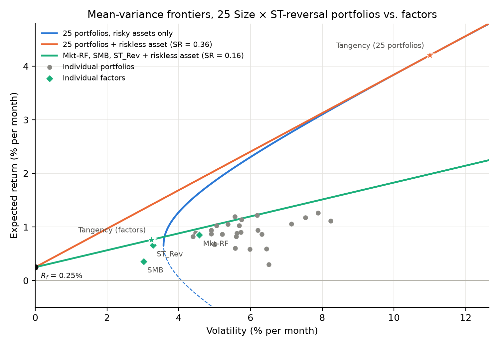

# Q1: Efficient frontiers

**Question:** plot the frontiers of the 25 portfolios (with and without the riskless asset) and of riskless + Mkt-RF, SMB, ST_Rev. How efficient are the factors vs. the portfolios, in terms of the tangency portfolios' E[R], volatility and Sharpe ratio (SR)?

Sample 1972-03 to 2025-04 (638 months). Riskless rate fixed at 0.25% per month. Code: `code/Q1.py`.

| Tangency portfolio | E[R] (%) | Vol (%) | SR monthly (annual) |
|---|---|---|---|
| 25 portfolios | 4.20 | 11.00 | 0.36 (1.24) |
| 3 factors | 0.76 | 3.24 | 0.16 (0.55) |
| *Mkt-RF alone* | *0.85* | *4.57* | *0.13 (0.46)* |

## Key insights

- **The factors are clearly inefficient.** Their line has less than half the slope of the 25-portfolio line (SR 0.16 vs 0.36), and several individual portfolios lie above it.
- **The factor tangency portfolio is 46% Mkt-RF, 58% ST_Rev and −4% SMB.** ST_Rev adds to the market, while SMB adds nothing.
- **The 25-portfolio tangency is extreme:** E[R] 4.20% and volatility 11.00% per month, with weights between −3.31 and +2.75. Its SR is inflated by in-sample estimation error, which Q4's out-of-sample test addresses.
- **Suggests** that the GRS test in Q2 will reject the factor models.
