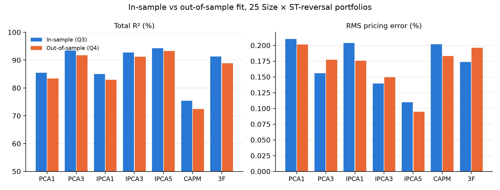

# Q4: Out-of-sample evaluation (240-month rolling windows)

**Question:** estimate PCA (K = 1, 3), IPCA (K = 1, 3, 5), the CAPM and 3F on rolling 240-month windows, then evaluate them on the next month. Report the average total-fit residual η and the average predicted pricing error α per portfolio, plus the total and predictive R². Compare with the in-sample results of Q3. Does PCA or IPCA help with 1 factor? With several?

Estimation windows of 240 months; out-of-sample months 1992-03 to 2025-04 (398 months). Code: `code/Q4.py`.

## Summary: out-of-sample (in-sample from Q3 in brackets)

| | PCA1 | PCA3 | IPCA1 | IPCA3 | IPCA5 | CAPM | 3F |
|---|---|---|---|---|---|---|---|
| Total R² (%) | 83.41 (85.42) | 91.78 (93.45) | 82.93 (84.97) | 91.19 (92.72) | **93.31** (94.22) | 72.44 (75.43) | 88.84 (91.27) |
| Predictive R² (%) | 1.08 (1.24) | 1.03 (1.29) | 1.10 (1.25) | 1.04 (1.29) | **1.11** (1.31) | 0.95 (1.25) | 1.02 (1.28) |
| Mean \|α\| (%) | 0.17 (0.15) | 0.16 (0.13) | 0.15 (0.16) | 0.13 (0.12) | **0.08** (0.09) | 0.17 (0.14) | 0.17 (0.13) |
| RMS α (%) | 0.20 (0.21) | 0.18 (0.16) | 0.18 (0.20) | 0.15 (0.14) | **0.09** (0.11) | 0.18 (0.20) | 0.20 (0.17) |
| Max \|α\| (%) | 0.37 (0.65) | 0.44 (0.39) | 0.37 (0.65) | 0.31 (0.34) | **0.16** (0.26) | 0.31 (0.61) | 0.42 (0.54) |

## Average η and α per portfolio (% per month, out-of-sample)

| | η PCA1 | η PCA3 | η IPCA1 | η IPCA3 | η IPCA5 | η CAPM | η 3F | α PCA1 | α PCA3 | α IPCA1 | α IPCA3 | α IPCA5 | α CAPM | α 3F |
|---|---|---|---|---|---|---|---|---|---|---|---|---|---|---|
| ME1 Lo PRIOR | −0.30 | −0.15 | −0.31 | −0.18 | −0.14 | −0.36 | −0.31 | −0.31 | −0.25 | −0.31 | −0.29 | −0.16 | −0.19 | −0.38 |
| ME1 PRIOR2 | 0.03 | 0.15 | −0.11 | 0.03 | −0.03 | −0.03 | 0.04 | 0.02 | 0.10 | −0.09 | −0.02 | 0.01 | 0.11 | 0.00 |
| ME1 PRIOR3 | 0.06 | 0.19 | −0.07 | 0.07 | −0.06 | 0.01 | 0.08 | 0.05 | 0.14 | −0.07 | 0.05 | −0.02 | 0.13 | 0.05 |
| ME1 PRIOR4 | 0.03 | 0.17 | −0.08 | 0.09 | 0.05 | −0.02 | 0.05 | 0.02 | 0.15 | −0.09 | 0.06 | −0.03 | 0.10 | 0.05 |
| ME1 Hi PRIOR | −0.36 | −0.17 | −0.35 | −0.21 | −0.17 | −0.41 | −0.32 | −0.37 | −0.16 | −0.37 | −0.16 | −0.14 | −0.29 | −0.29 |
| ME2 Lo PRIOR | −0.09 | −0.04 | 0.01 | 0.02 | 0.08 | −0.17 | −0.14 | −0.10 | −0.14 | −0.01 | −0.05 | 0.08 | −0.02 | −0.20 |
| ME2 PRIOR2 | 0.16 | 0.21 | 0.12 | 0.17 | 0.11 | 0.08 | 0.15 | 0.15 | 0.14 | 0.10 | 0.10 | 0.10 | 0.21 | 0.10 |
| ME2 PRIOR3 | 0.15 | 0.20 | 0.09 | 0.17 | 0.13 | 0.08 | 0.14 | 0.14 | 0.18 | 0.08 | 0.13 | 0.06 | 0.20 | 0.13 |
| ME2 PRIOR4 | 0.08 | 0.14 | 0.05 | 0.15 | 0.13 | 0.00 | 0.07 | 0.06 | 0.13 | 0.03 | 0.13 | 0.07 | 0.11 | 0.08 |
| ME2 Hi PRIOR | −0.19 | −0.08 | −0.13 | −0.08 | 0.08 | −0.27 | −0.18 | −0.20 | −0.04 | −0.14 | −0.00 | −0.01 | −0.15 | −0.12 |
| ME3 Lo PRIOR | −0.19 | −0.22 | −0.10 | −0.13 | −0.04 | −0.29 | −0.27 | −0.21 | −0.29 | −0.11 | −0.20 | −0.10 | −0.15 | −0.31 |
| ME3 PRIOR2 | 0.23 | 0.19 | 0.20 | 0.19 | 0.06 | 0.13 | 0.17 | 0.22 | 0.15 | 0.19 | 0.14 | 0.12 | 0.24 | 0.16 |
| ME3 PRIOR3 | 0.17 | 0.13 | 0.16 | 0.15 | 0.03 | 0.07 | 0.12 | 0.15 | 0.12 | 0.13 | 0.14 | 0.06 | 0.17 | 0.12 |
| ME3 PRIOR4 | 0.07 | 0.06 | 0.06 | 0.03 | 0.01 | −0.03 | 0.04 | 0.06 | 0.08 | 0.05 | 0.10 | −0.00 | 0.08 | 0.07 |
| ME3 Hi PRIOR | −0.20 | −0.16 | −0.12 | −0.12 | −0.06 | −0.29 | −0.21 | −0.22 | −0.08 | −0.15 | −0.07 | −0.08 | −0.19 | −0.14 |
| ME4 Lo PRIOR | −0.26 | −0.38 | −0.16 | −0.28 | −0.20 | −0.38 | −0.40 | −0.27 | −0.44 | −0.16 | −0.31 | −0.12 | −0.25 | −0.42 |
| ME4 PRIOR2 | 0.32 | 0.21 | 0.32 | 0.21 | 0.14 | 0.20 | 0.22 | 0.31 | 0.19 | 0.32 | 0.22 | 0.15 | 0.31 | 0.23 |
| ME4 PRIOR3 | 0.28 | 0.18 | 0.27 | 0.15 | 0.07 | 0.16 | 0.19 | 0.27 | 0.19 | 0.25 | 0.20 | 0.13 | 0.25 | 0.22 |
| ME4 PRIOR4 | 0.19 | 0.12 | 0.21 | 0.13 | 0.09 | 0.07 | 0.12 | 0.18 | 0.16 | 0.20 | 0.19 | 0.10 | 0.16 | 0.18 |
| ME4 Hi PRIOR | −0.16 | −0.19 | −0.07 | −0.16 | −0.09 | −0.28 | −0.23 | −0.17 | −0.09 | −0.11 | −0.08 | −0.12 | −0.18 | −0.11 |
| ME5 Lo PRIOR | −0.03 | −0.25 | −0.00 | −0.18 | −0.09 | −0.18 | −0.25 | −0.04 | −0.25 | −0.02 | −0.20 | −0.01 | −0.07 | −0.21 |
| ME5 PRIOR2 | 0.33 | 0.14 | 0.26 | 0.09 | 0.07 | 0.18 | 0.16 | 0.32 | 0.16 | 0.27 | 0.12 | 0.13 | 0.26 | 0.21 |
| ME5 PRIOR3 | 0.28 | 0.11 | 0.24 | 0.10 | −0.00 | 0.13 | 0.13 | 0.27 | 0.16 | 0.22 | 0.11 | 0.06 | 0.20 | 0.21 |
| ME5 PRIOR4 | 0.17 | 0.02 | 0.15 | 0.01 | −0.01 | 0.02 | 0.03 | 0.17 | 0.11 | 0.14 | 0.07 | 0.00 | 0.09 | 0.16 |
| ME5 Hi PRIOR | −0.02 | −0.16 | −0.01 | −0.22 | −0.15 | −0.18 | −0.15 | −0.03 | −0.00 | −0.03 | −0.07 | −0.12 | −0.11 | 0.02 |

## Key insights

- **Out of sample, the ranking of the models holds.** Total R² drops by only 1 to 3 points for every model, so the factor structure is stable. IPCA5 stays on top (93.31%) and loses the least (0.9 points). The CAPM (−3.0) and 3F (−2.4) lose the most.
- **1 factor: IPCA1 prices slightly better, PCA1 fits slightly better.** PCA1 keeps a marginally higher total R² (83.41% vs 82.93%), while IPCA1 has smaller pricing errors (mean |α| 0.15% vs 0.17%, RMS 0.18% vs 0.20%). Both explain far more variation than the CAPM (72.44%) but price about as poorly.
- **Several factors: the IPCA advantage grows out of sample.** Pricing errors deteriorate for PCA3 (RMS 0.16 → 0.18) and 3F (0.17 → 0.20), but hold for IPCA3 (0.14 → 0.15) and even improve for IPCA5 (0.11 → 0.09, max |α| only 0.16%). Characteristic-based loadings carry over to new months better than static loadings estimated per portfolio.
- **Predictive R² falls to about 1% for every model** (from about 1.3% in-sample). IPCA5 (1.11%) and IPCA1 (1.10%) are highest, and the CAPM (0.95%) is lowest.
- **Some portfolios stay mispriced for every model:** small losers (−0.14 to −0.38) and PRIOR2–3 portfolios of mid and large caps (+0.1 to +0.3). IPCA5 halves most of these but does not remove them.

*Method notes:*
- *The window for month t uses 240 returns up to and including t. The model is then evaluated on r_{t+1} using the instruments known at the start of month t+1, which are not used in estimation. We use the same predicted loadings Z_{t+1}Γ̂β,t in steps 4 and 5.*
- *IPCA uses a warm start from the previous window's Γ̂β. The observable models use window betas without a constant and λ̂_t equal to the window factor means.*
- *The out-of-sample period (1992–2025) is shorter than the in-sample period (1972–2025), so the levels of the pricing errors are not strictly comparable. Differences between models within each column are.*
- *Across all models, average |η| is almost equal to average |α|: the factor realisations average close to λ̂, so the mean pricing error dominates both series.*
